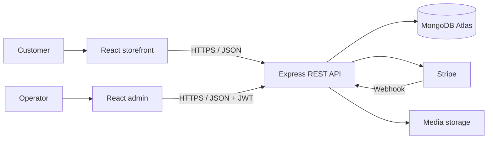

# MERN Commerce Platform

A portfolio-grade full-stack ecommerce platform built as a three-application
monorepo: a customer storefront, an operations dashboard, and a REST API.

> **Status:** Active development. The application is deployment-ready; production
> URLs will be added after the cloud services are provisioned.

## Engineering highlights

- Full MERN architecture with React 19, Express 5, MongoDB/Mongoose, and Node.js
- Separate customer and administrator experiences
- Reusable Axios integration with environment-based API URLs
- JWT authentication, password hashing, protected endpoints, and role-based access
- Products, categories, carts, wishlists, addresses, orders, coupons, and reviews
- Stripe payment intents, confirmation, and webhook handling
- Configurable hero slides, banners, deals, and catalog content
- OpenAPI/Swagger documentation, centralized errors, CORS allow-listing, and health checks
- Automated lint, production-build, and backend syntax checks

## Repository structure

```text
.
├── admin/                 # React/Vite operations dashboard
├── backend/               # Express API and MongoDB models
├── frontend/              # React/Vite customer storefront
├── docs/
│   ├── ARCHITECTURE.md
│   ├── DEPLOYMENT.md
│   └── ROADMAP.md
├── .github/workflows/     # Continuous integration
├── render.yaml            # API deployment blueprint
└── package.json           # Monorepo convenience commands
```

## Capabilities

### Customer storefront

- Responsive catalog, filtering, search, product details, and related products
- Registration, login, cart, wishlist, delivery addresses, coupons, and checkout
- Reviews, promotional content, deal sections, and API loading/error states

### Admin dashboard

- Commerce metrics and operational views
- Product, category, coupon, banner, and hero-slide CRUD
- Order detail and status management
- User and review management
- Reusable resource-driven forms and tables

### Backend API

- Modular routes, controllers, models, middleware, and configuration
- JWT/bcrypt authentication and administrator-only mutations
- MongoDB commerce schemas and RESTful resources
- Stripe payment endpoints, media uploads, Swagger UI, and a health endpoint

## Architecture



See [the architecture notes](docs/ARCHITECTURE.md) for system boundaries,
security decisions, and request flows.

## Local development

Requirements: Node.js 20+, npm, and MongoDB locally or on Atlas.

```bash
npm run install:all
```

Create local environment files from the committed examples:

```bash
cp backend/.env.example backend/.env
cp frontend/.env.example frontend/.env
cp admin/.env.example admin/.env
```

On PowerShell, use `Copy-Item` instead of `cp`. Never commit real `.env` files.

Run each service in a separate terminal:

```bash
npm run dev:api
npm run dev:store
npm run dev:admin
```

| Service | Default URL |
|---|---|
| Storefront | `http://localhost:5173` |
| Admin dashboard | `http://localhost:5174` |
| REST API | `http://localhost:5000` |
| Swagger UI | `http://localhost:5000/docs` |

## Quality commands

```bash
npm run build
npm run lint
npm run check:api
npm run verify
```

## API surface

The API covers `auth`, `products`, `categories`, `cart`, `wishlist`, `addresses`,
`orders`, `coupons`, `reviews`, `hero-slides`, `banners`, `uploads`, `dashboard`,
`admin/users`, and `payments`. Interactive endpoint documentation is available at
`/docs` while the API is running.

## Security and privacy

Real environment files, dependencies, builds, uploaded customer files, and secrets
are excluded from Git. The public repository must use only synthetic demo data.
See [SECURITY.md](SECURITY.md) for deployment guidance.

## Deployment

The storefront and admin app deploy independently as static Vite projects; the
backend deploys as a Node service and connects to MongoDB Atlas. See the
[deployment runbook](docs/DEPLOYMENT.md) for exact settings and verification.

## Roadmap

Planned milestones include durable cloud media, automated backend tests, token
hardening, observability, accessibility auditing, and containerized delivery.
See [docs/ROADMAP.md](docs/ROADMAP.md).

## Author

Designed and developed by **Murtaza Ahmad** to demonstrate full-stack MERN
engineering, REST API design, responsive UI development, and commerce-domain
problem solving.

## License

[MIT](LICENSE)
